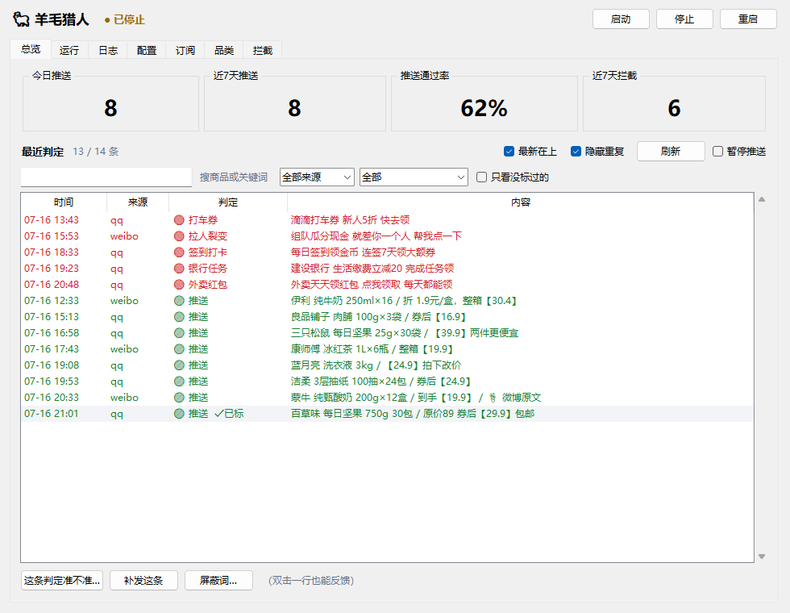
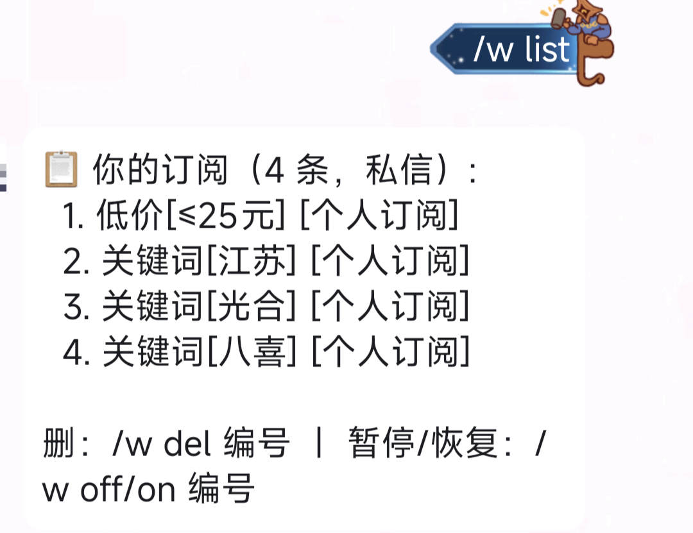
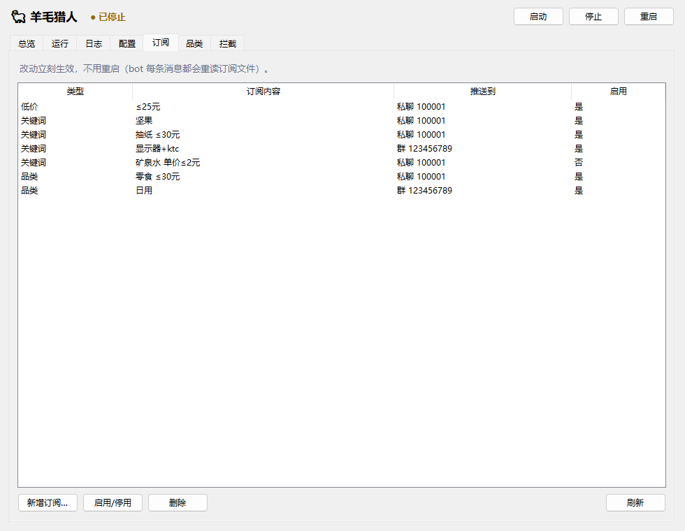
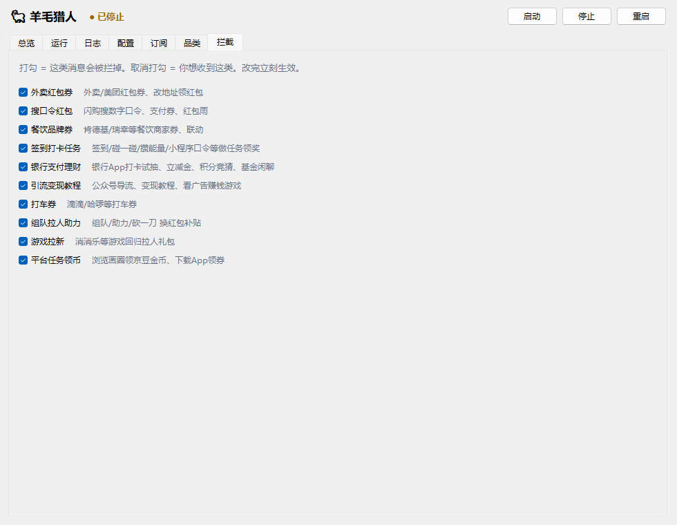
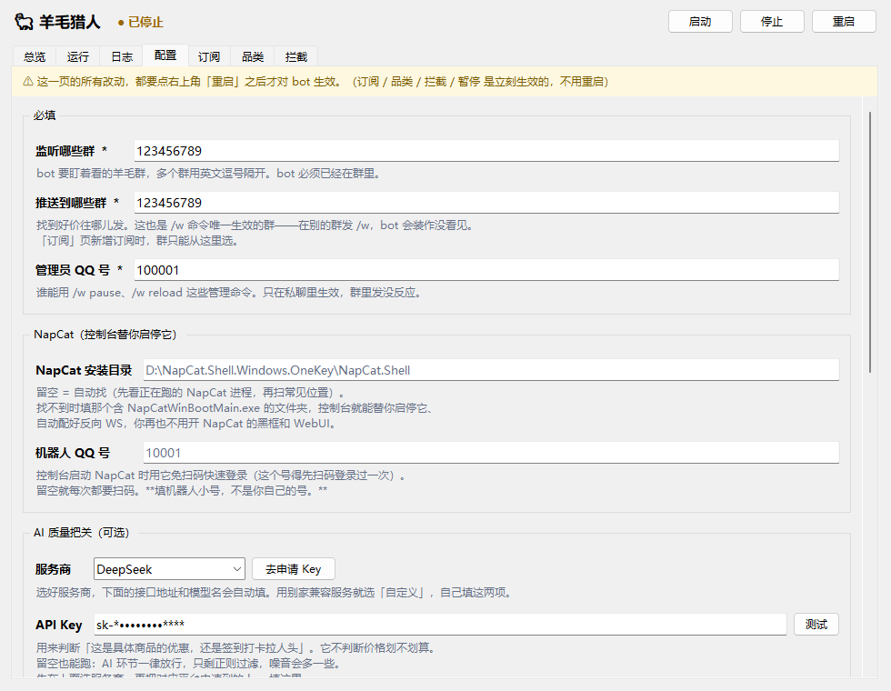

# 羊毛猎人 🐑 — QQ / 微博 羊毛监听机器人

监听 QQ 羊毛群和微博博主，把「是真商品优惠」的消息按你的订阅**只挑你要的**转发给你。

羊毛群一天几百条，90% 与你无关：外卖红包、银行打卡、组队砍一刀、游戏拉新。你想要的也许只是「≤20 元的东西」「所有冰淇淋」「带『临期』的」——把需求告诉它，其余的它替你挡掉。

**全部操作都在一个桌面控制台里完成**——配置、启停、看日志、改订阅，不碰命令行，不编辑配置文件。

<p align="center">
  
</p>

> 它不替你判断「价格划不划算」——那由**你自己设的金额门槛**决定。AI 只回答一件事：*这到底是不是一个具体商品的可购买优惠，还是签到打卡拉人头的活动帖？*

---

## 长什么样

**你在 QQ 里这样用它**（群里记得 @ 一下机器人）：

<p align="center">
  
  
</p>

**改订阅 / 调拦截 / 填配置，都在控制台点点点**：

<p align="center">
  
  
  
</p>

---

## 三类订阅

| 类型 | 命令 | 命中条件 |
|---|---|---|
| **低价** | `/w low 20` | 估算到手价 ≤ 20 元。纯门槛，不看是什么商品 |
| **关键词** | `/w add 耳机` | 词命中。单词走 AI 语义扩展（订「抽纸」也收到纸巾/手帕纸）；多词字面 AND |
| **品类** | `/w cat 零食` | 属于该品类（词表匹配，漏收录的由 AI 兜底归类） |

三类可同时订，命中任一即推送。关键词/品类还能再加价格上限，且能分「总价」和「单价」两种口径 —— 「零食 且 ≤20 元」「矿泉水 且 每瓶 ≤2 元」都能表达。

「在哪里发命令，就推到哪里」：群里发 → 推到该群；私聊发 → 私信你。

```
/w low 20              到手价 ≤20 元就推
/w add 耳机            订关键词「耳机」
/w cat 零食 ≤20        订品类「零食」，且 ≤20 元
/查 纸巾               翻最近两天含「纸巾」的羊毛（含被拦的）
```

> 📖 完整命令、价格口径、过滤流程 → **[使用手册](docs/使用手册.md)**

---

## 快速开始

大约 30 分钟，不需要懂 Python。这里是骨架，**每一步的详细图文在 [使用手册 · 完整安装](docs/使用手册.md#一完整安装约-30-分钟)**。

1. **装 Python** 3.10+（安装时勾上 `Add Python to PATH`）
2. **[下载最新版 zip](https://github.com/irito045/wool-hunter/releases/latest)** → 解压 → `pip install -r requirements.txt`
3. **下载 [NapCatQQ](https://github.com/NapNeko/NapCatQQ/releases)**（选 `Windows.OneKey` 版）→ 解压就好，别启动它
4. 双击 **`console.bat`** → 「配置」页填三项必填（监听群 / 推送群 / 管理员 QQ）
5. 「运行」页点 **「扫码登录」**，用机器人小号扫码
6. 环境体检前四项绿了 → 点 **「启动」**

装好后，在**私聊**给机器人发 `/w` 应该回一大段菜单；发 `/w low 20` 就订上了。

> 💡 需要准备：两个 QQ 号（机器人用**小号**，有封号风险）、一个接收群、一台常开的电脑。AI Key 可选但强烈建议（DeepSeek 一个月几毛钱）。

---

## 它凭什么可靠

- **控制台不需要 bot 在跑就能开** —— 首次配置、bot 崩了、配错了，恰恰是寄生在 bot 里的界面打不开的时候。它自己还是看门狗，bot 崩了 3 秒拉起来。
- **环境体检逐项真去验** —— 不是看你填没填，是真去连、真去测。NapCat 停在扫码界面时端口就开了，所以它不看端口，只认「真登录 + 真连上 bot」。
- **隐私** —— 用户群里机器人只回应 @ 它的消息，不对群友闲聊有反应。含隐私的数据文件都在 `.gitignore` 里。
- **200+ 单元测试**，CI 在 Python 3.10 / 3.13 上每次跑；改过滤/价格逻辑还要拿真实历史数据回放，以「零回归」为门槛。

---

## 免责声明

- **这是个 QQ 自动化工具。** 腾讯用户协议禁止第三方客户端，账号有**被封风险**。请务必用小号，别用主账号。
- 本项目通过 [NapCatQQ](https://github.com/NapNeko/NapCatQQ) 与 QQ 通信，其合规性由该项目自行负责。
- 微博监控读取的是公开内容，请遵守微博服务条款，别把检查间隔调得过短。
- 本项目**仅供学习和个人使用**。作者不对账号封禁、数据丢失、错过或误收优惠等任何后果负责。
- 转发的商品链接来自第三方，真实性/时效性/安全性不作保证，**下单前请自行核实**。

## License

MIT

---

📖 [使用手册](docs/使用手册.md) · 🛠 [开发者笔记 CLAUDE.md](CLAUDE.md)
